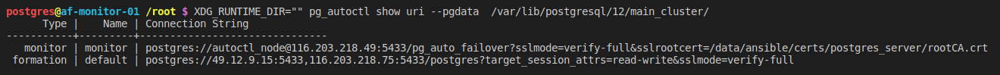

# pg_auto_failover_ansible
Ansible Playbook(s) to create a cluster of PostgreSQL nodes running in a Ubuntu 18.04 cluster with [pg_auto_failover](https://github.com/citusdata/pg_auto_failover) 1.3 and PostgreSQL 12.

## Current features

- Automatically setup a secure cluster with 1 monitor node and 2 database nodes with synchronous replication
- Support for Ubuntu 18.04
- Support for PostgreSQL 12

## Not features

- The installation script for pg_auto_failover `roles/postgres-cluster-pg-auto-failover-install/files/deb.sh` was manually downloaded from the [citus homepage](https://install.citusdata.com/community/deb.sh). To update it, you have to replace it manually.
- Removal of old nodes has to be done manually. New data nodes can be added to the cluster by just running all playbooks again.
- NO automatic configuration of backups - Replication does NOT replace regular backups!
- By default this playbook leaves the default clusters that might
be present on your machines after installation and uses a different port than the default (`5433` - this is configurable)

## Used Software

The following roles are based on [geerlingguy's work](https://github.com/geerlingguy/ansible-role-postgresql) but heavily modified to work with pg_auto_failover

- passbolt-cluster-configure
- passbolt-cluster-hba-config
- passbolt-cluster-install

## Testing

Requirements:

- vagrant
- virtualbox
- psql

To test out the functionality and/or want to run the tests for this project, go to `test/` and run `bash setup_for_test.sh` and then `run.sh`.

## Usage

### Setup Inventory

1. Go to `inventories/pg_auto_failover/hosts.yml` and adjust the ips of your hosts according to your requirements.
2. Put your root ssh key under `ssh_keys/root_rsa`.

### Setup certificates

#### 0. fix all certificate information strings

Update `certs/pg_auto_failover/gen_root_cert.sh` and `certs/certs/pg_auto_failover/gen_server_cert.sh` to contain all the correct properties for your certificates. (Fix all occurences of `your-company`).

#### 1. create new root certificate

Update file `certs/pg_auto_failover/recreate_root_cert.sh` according to your requirements (passworded certificate is not used here, but it is a good idea to set a separate one for each deployment you are using this in)


Then, run:

```bash
cd certs/pg_auto_failover
bash recreate_root_cert.sh
```

#### 2. generate server certificates

Update file `certs/pg_auto_failover/recreate_server_certs.sh`. Paths should correspond to the hostnames in your ansible inventory

Then, run:

```bash
cd certs/pg_auto_failover
bash recreate_server_certs.sh
```

This will copy all certificates into the correct place for them to be picked up by ansible.


### Run base setup

0. remove existing ssh keys of you machines into your known hosts (only run this if you have rebuilt your machines and the ssh key has changed):

    For each relevant node run:

    ```bash
    ssh-keygen -f ~/.ssh/known_hosts <ip>
    ```

1. put the ssh keys of your machines into your known hosts:

    For each node run:

    ```bash
    ssh-keyscan <ip> >> ~/.ssh/known_hosts
    ```

2. Run the actual base_setup playbook

    ```bash
    ansible-playbook -i inventories/pg_auto_failover/hosts.yml base_setup.yml
    ```
### Run the actual cluster setup

```bash
ansible-playbook -i inventories/pg_auto_failover/hosts.yml postgres_cluster_servers.yml
```

### Verify setup

```bash
ssh -i ssh_keys/root_rsa root@<manager-ip>
sudo su postgres
XDG_RUNTIME_DIR="" pg_autoctl show state --pgdata  /var/lib/postgresql/12/main_cluster/
```

If everything is okay, you should be greeted with the following:


### Next steps

- Setup pg_hba config in inventory configuration to allow connection to all the databases you will create/need
- create all databases

### Connection to the cluster

Just ask the monitor node :)

```bash
XDG_RUNTIME_DIR="" pg_autoctl show uri --pgdata  /var/lib/postgresql/12/main_cluster/
```


